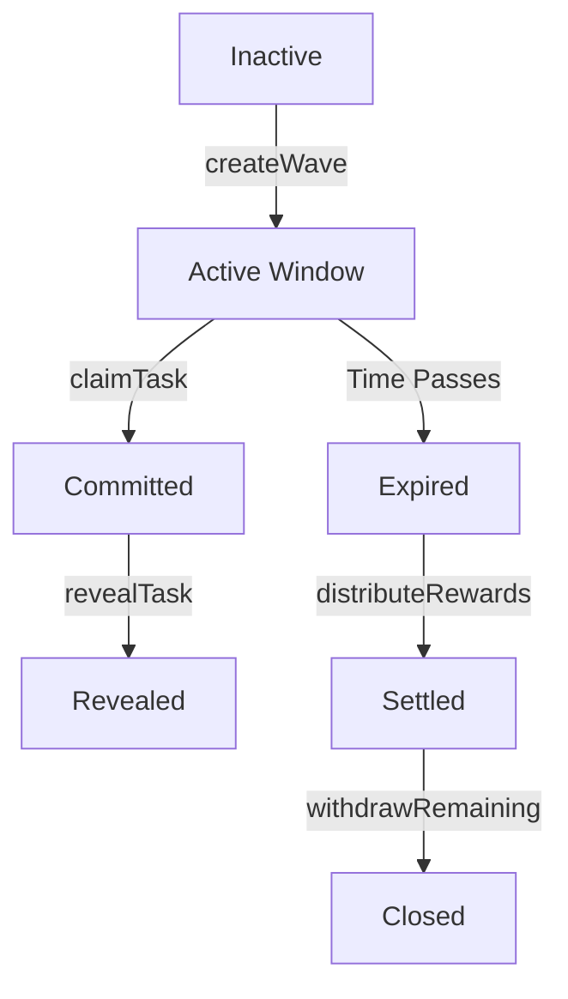

# WaveFlow: Automated Scheduler & Escrow 🌊

WaveFlow is a sophisticated decentralized protocol designed to streamline the lifecycle of contribution "Waves." It combines precise temporal scheduling with a secure escrow system and a front-run resistant claim mechanism to ensure fair and transparent reward distribution for open-source and community projects.

---

## 🌟 Overview

The core mission of WaveFlow is to automate the management of monthly bounty windows. Maintainers define specific **"Activity Windows"** (e.g., the first 7 days of every month) where contributions are eligible for rewards. By locking budgets into a smart contract and utilizing a cryptographic commit-reveal scheme, WaveFlow eliminates trust barriers between maintainers and contributors.

WaveFlow transforms how community rewards are handled by:
1.  **Eliminating Human Error**: Automation ensures windows start and end exactly when planned.
2.  **Securing Capital**: Contributors work with the peace of mind that funds are already held by a neutral smart contract.
3.  **Preventing Front-Running**: The commit-reveal pattern ensures that ideas and claims cannot be stolen by bots or malicious actors observing the mempool.

---

## 🏗️ Architecture

WaveFlow is built on a modular architecture that prioritizes security, scalability, and transparency.

### 1. Data Structures & Storage
The system tracks the state of every reward cycle using a centralized mapping of `waveId` to a comprehensive `Wave` struct.

```solidity
struct Wave {
    uint256 budget;          // Total ETH/Token budget allocated for this wave
    uint256 startTime;       // Unix timestamp for wave activation
    uint256 duration;        // Duration in seconds (e.g., 604800 for 7 days)
    bool distributed;        // Status flag for reward settlement
    uint256 totalAllocated;  // Tracked amount of budget actually spent
}
```

- **Commit-Reveal Storage**: A three-dimensional mapping `mapping(uint256 => mapping(address => mapping(bytes32 => Commit)))` ensures that every contributor's claim is unique to a specific wave and task.
- **Role Management**: Uses OpenZeppelin's `AccessControl` for granular permissions, allowing for multiple maintainers with varied authority levels.

### 2. Logic Flow & State Machine
A Wave moves through a strict linear progression to ensure deterministic outcomes.



### 3. Security Core
WaveFlow leverages industry-standard security patterns:
-   **Reentrancy Protection**: All payout logic is wrapped in `nonReentrant` modifiers.
-   **Access Control**: A granular `MAINTAINER_ROLE` manages administrative actions.
-   **Front-Running Prevention**: The **Commit-Reveal** pattern ensures that a contributor's task claim is kept secret (via hash) until they are ready to prove their work.
-   **Overflow Protection**: Built-in Solidity 0.8+ overflow checks for all arithmetic operations.

---

## 🛠️ Technical Deep Dive

### The Commit-Reveal Pattern
To prevent "gas wars" and "claim sniping," WaveFlow uses a two-step verification process:

1.  **Commit Phase**:
    -   The contributor chooses a secret string (e.g., `"my_secret_123"`).
    -   They compute `keccak256(abi.encodePacked(secret))`.
    -   They submit this hash to the contract. The mempool only sees the hash, not the secret.
2.  **Reveal Phase**:
    -   The contributor submits the plain text secret.
    -   The contract hashes the input and compares it to the stored commitment.
    -   If they match, the claim is validated.

### Gas Optimization Strategies
-   **Calldata vs Memory**: All array parameters in `distributeRewards` use `calldata` to minimize gas consumption during iteration.
-   **Storage Packing**: Structs are designed to fit into minimal storage slots where possible.
-   **Batch Processing**: Rewards are distributed in batches to reduce the overhead of multiple transactions.

---

## 📋 Detailed Workflows

### For Maintainers
1.  **Setup**: Deploy the contract and grant `MAINTAINER_ROLE` to trusted entities.
2.  **Scheduling**: Call `createWave` with a start time, duration, and the total budget in ETH.
3.  **Observation**: Monitor `TaskRevealed` events to track contribution progress.
4.  **Distribution**: Once the wave duration has elapsed, call `distributeRewards` with the list of contributors and their earned amounts.
5.  **Cleanup**: If any budget remains (e.g., tasks not completed), call `withdrawRemaining` to reclaim funds.

### For Contributors
1.  **Discovery**: Find an active Wave and identify a task to complete.
2.  **Commitment**: Generate a secret and submit its hash via `claimTask`.
3.  **Work**: Complete the contribution within the wave window.
4.  **Revelation**: Call `revealTask` with the original secret before the wave expires.
5.  **Payment**: Receive rewards automatically once the maintainer triggers distribution.

---

## 🚀 Deployment & Development

### Prerequisites
-   **Node.js**: v18.0.0 or higher
-   **Hardhat**: v2.22.0
-   **Ethers.js**: v6.x

### Quick Start
```bash
# Install dependencies
npm install

# Compile contracts
npx hardhat compile

# Run test suite
npx hardhat test

# Deploy to local network
npx hardhat run scripts/deploy.js --network localhost
```

### Environment Configuration
Create a `.env` file in the root directory:
```env
PRIVATE_KEY=your_private_key
RPC_URL=your_rpc_url
ETHERSCAN_API_KEY=your_api_key
```

---

## 🛣️ Roadmap

-   [ ] **Phase 1**: Core protocol deployment (Current).
-   [ ] **Phase 2**: ERC20 token support for bounty payouts.
-   [ ] **Phase 3**: Integration with decentralized identity (DID) for contributor reputation.
-   [ ] **Phase 4**: Automated periodic waves using Chainlink Keepers.

## 🤝 Contributing
Contributions are welcome! Please follow these steps:
1.  Fork the Project.
2.  Create your Feature Branch (`git checkout -b feature/AmazingFeature`).
3.  Commit your Changes (`git commit -m 'Add some AmazingFeature'`).
4.  Push to the Branch (`git push origin feature/AmazingFeature`).
5.  Open a Pull Request.

## 📜 License
This project is licensed under the MIT License - see the [LICENSE](LICENSE) file for details.

---

## ❓ FAQ

**Q: What happens if a maintainer forgets to distribute rewards?**
A: The funds remain locked in the contract. However, the protocol is designed to be governed by a DAO or multi-sig to ensure accountability.

**Q: Can I claim multiple tasks in a single wave?**
A: Yes, as long as each task has a unique `taskId`.

**Q: Is there a limit to how long a wave can be?**
A: No technical limit, but maintainers are encouraged to keep them within 7-30 days for optimal community engagement.
